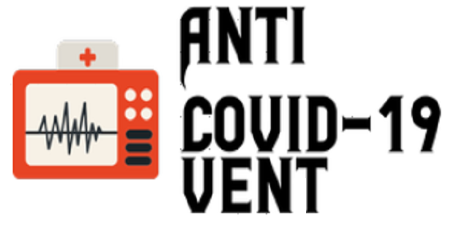
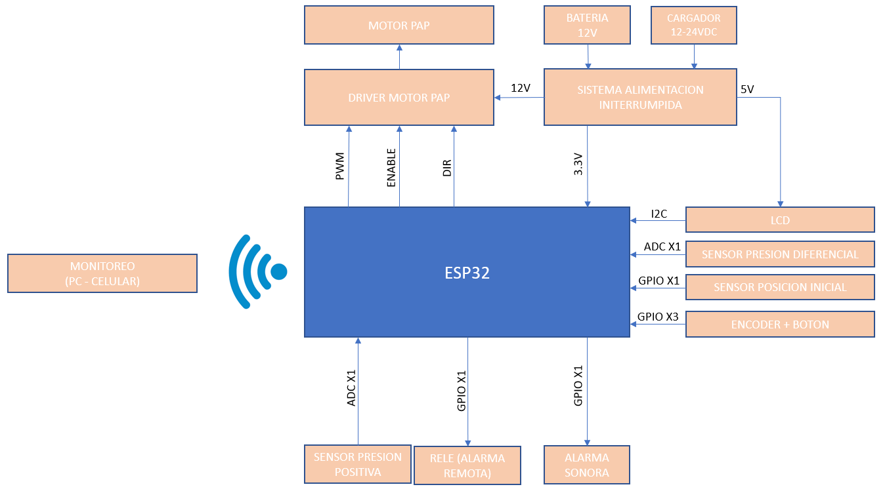

[//]: # (Programado con lenguaje Markdown)

# DELTA ROBOT

Diseño robot delta

## Introducción

## Requerimientos

## Diseño

Se creo un [foro](https://xmartplm.com/covid19-colombia/) para la discusión en comunidad sobre el diseño de un ventilador para afrontar la crisis del COVID-19. Como conclusión se deben afrontar los siguientes temas:

* Seleccionar tipo de control.
* Diseño mecánico.
* Diseño electrónico.
* Realización prototipo.
* Pruebas.

### Diseño electrónico general

